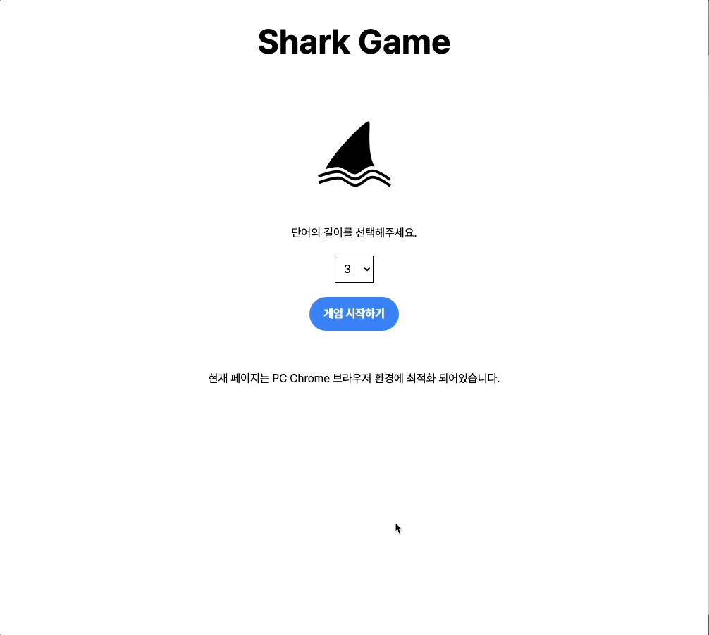
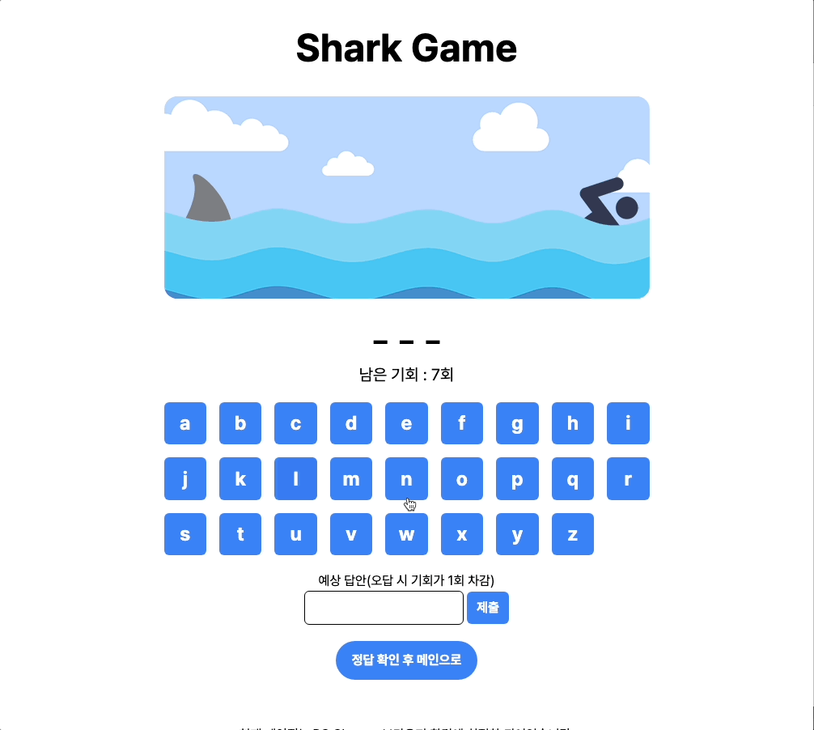
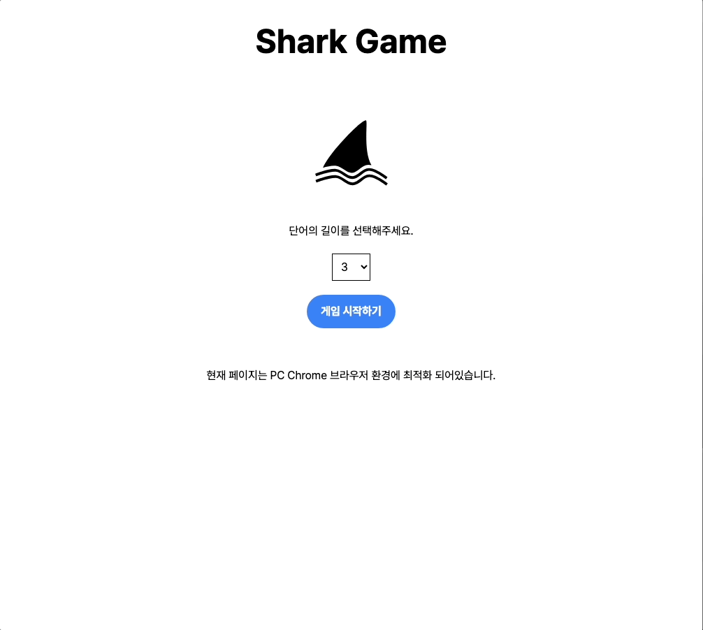
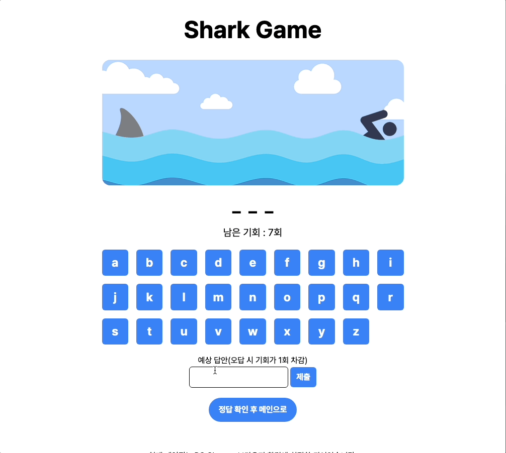
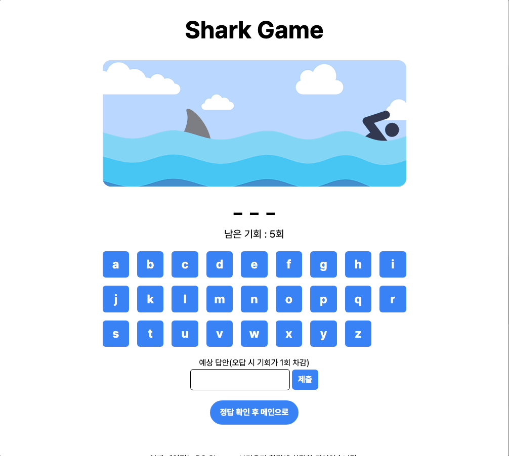

# 🦈 Shark Game (행맨 주제)


항해 플러스: 제1회 코육대 참가 레포지토리(주제 : 행맨) 참가 레포지토리입니다.

## 🎯 프로젝트 소개

- 주제 : 행맨 게임
- 작업 기간 : 2023.09.28 ~2023.09.29
- 인원 : 1명

## 📝 구현 요구사항

1.  화면에 26개 알파벳 버튼을 띄우기.
2.  선택한 알파벳과 정답을 비교하는 기능.
3.  일치하는 알파벳이 있을 경우 기존 UI에서 사라지고 해당 위치에 표시.
4.  틀릴 경우 오류 횟수를 증가.
5.  오류 날 때마다 ‘교수대-밧줄-머리-팔-손-몸통-다리-발’ 순서로 그려서 그림이 완성되면 ‘실패’ 를 띄우기. (오류 횟수 8번 이상은 실패)

## 🛠 사용한 기술 스택 및 라이브러리

      

## 🎬 프로젝트 로컬 실행 방법

1. 본 repository를 clone합니다.

```bash
git clone https://github.com/chaehaeun/shark-game.git
```

2. 의존성 패키지를 설치합니다.

```bash
npm install
```

3. 로컬호스트를 실행합니다.

```bash
npm run dev
```

## 🚀 배포 링크

[👉 배포 링크로 이동](https://shark-game-five.vercel.app/)

## 🗂️ 폴더 구조

```zsh
.
├── README.md
├── index.html
├── package-lock.json
├── package.json
├── postcss.config.js
├── public
│   └── vite.svg
├── src
│   ├── App.tsx
│   ├── api
│   │   ├── getWordApi.ts
│   │   └── index.ts
│   ├── assets
│   │   ├── shark.png
│   │   ├── sky.png
│   │   └── water.png
│   ├── components
│   │   ├── common
│   │   │   ├── Button.tsx
│   │   │   ├── Modal.tsx
│   │   │   ├── RootLayout.tsx
│   │   │   └── index.ts
│   │   └── index.ts
│   ├── constants
│   │   └── index.ts
│   ├── hooks
│   │   └── useModal.tsx
│   ├── index.css
│   ├── main.tsx
│   ├── pages
│   │   ├── Game.tsx
│   │   ├── Main.tsx
│   │   ├── NotFound.tsx
│   │   └── index.ts
│   ├── router
│   │   └── index.tsx
│   ├── sky.png
│   ├── store
│   │   ├── gameState.ts
│   │   └── index.ts
│   └── vite-env.d.ts
├── tailwind.config.js
├── tsconfig.json
├── tsconfig.node.json
├── vercel.json
└── vite.config.ts
```

## ✏️ 구현 내용

| 정답 맞추기 실패              | 정답 맞추기 성공             |
| ----------------------------- | ---------------------------- |
|  |  |

| 정답 예측 실패                     | 정답 예측 성공                   |
| ---------------------------------- | -------------------------------- |
|  |  |

| 게임 포기                      |
| ------------------------------ |
|  |

#### 랜덤 영단어 API 이용하여 데이터 가져오기

```tsx
const handleGameSet = async () => {
  const selectedLength = selectRef.current?.value;

  if (selectedLength) {
    setIsLoading(true);
    try {
      const res = await getWord(+selectedLength);
      setgameSet(res[0]);
      navigate("/game");
    } catch (e: any) {
      if (e.response.status === 503) {
        alert("서버가 불안정합니다. 잠시 후 다시 시도해주세요.");
      }

      alert("단어를 불러오는 데 실패했습니다.");
    } finally {
      setIsLoading(false);
    }
  }
};
```

- `axios`를 이용하여 랜덤 영단어 API(https://random-word-api.herokuapp.com/)를 호출합니다.
- `select` 태그로 영단어 글자 수를 선택한 후 게임 시작 버튼을 누르면 해당 글자 수에 맞는 랜덤 영단어를 가져옵니다.
- 기능 테스트 도중 API 서버가 일정 시간 작동하지 않는 경우가 있어 `try-catch`문으로 예외처리를 해주었습니다.

#### 행맨 디자인 변경

- 어린이용 게임으로는 잔인하다는 의견이 많은 기존 Hangman 디자인을 이미지 소스를 직접 제작한 Shark 디자인으로 변경하여 이미지를 조금 순화 시키고 오답시 상어의 위치만 옮김으로써 기회가 줄어드는 것을 표현했습니다.
- 기존 행맨보다 남은 기회가 불명확하기 때문에 남은 기회를 직관적으로 명시해주었습니다.

#### 알파벳 버튼 비활성화 기능

```tsx
const [pressedLetters, setPressedLetters] = useState<string[]>([]);

const handleLetterClick = (letter: string) => {
  setPressedLetters((prevLetters) => [...prevLetters, letter]);

  if (!gameSet?.includes(letter)) {
    setCount((prevCount) => prevCount - 1);
  }
};
```

- `useState`를 이용하여 이미 선택한 알파벳을 저장합니다.
- 이미 선택한 알파벳은 버튼을 비활성화 시켜 다시 선택할 수 없도록 하였습니다.

#### 정답 예측 기능

```tsx
const handleAnswerSubmit = (e: React.FormEvent<HTMLFormElement>) => {
  e.preventDefault();
  if (!gameSet) return;

  const guessedWord = inputRef.current?.value.toLowerCase();

  if (guessedWord?.trim() === gameSet) {
    endGame(true);
  } else {
    setCount((prevCount) => prevCount - 1);
  }

  inputRef.current!.value = "";
  inputRef.current!.focus();
};
```

- `form` 태그를 이용하여 정답을 예측할 수 있도록 하였습니다.
- `input` 태그에 입력한 값과 정답을 비교하여 정답을 맞추면 게임을 종료하고, 틀리면 오류 횟수를 증가시킵니다.
- 대소문자를 구분하지 않도록 `toLowerCase()`를 이용하여 답안을 소문자로 변환한 후 비교하도록 하였습니다.

#### 포탈을 이용한 모달 기능

- `react-router-dom`의 `Portal`을 이용하여 모달을 구현하였습니다.
- 게임 승패 여부에 따라 다른 내용을 출력하도록 조건부 렌더링을 하였습니다.
